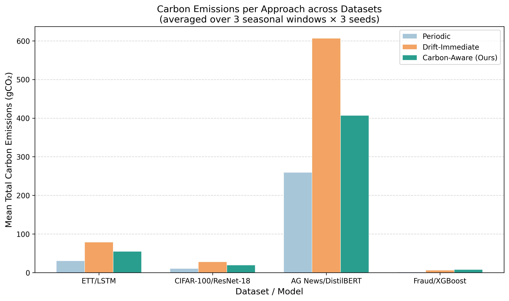
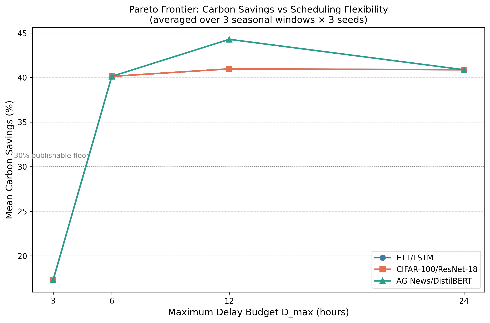

# GreenMLOps

A retraining scheduler that waits for the electricity grid to run cleaner before it retrains a model.

When a deployed model drifts, the normal response is to retrain right away. Retraining burns electricity, and the carbon cost of that electricity swings by a factor of three or more over a single day depending on what is generating it. GreenMLOps separates *when retraining is needed* from *when it actually runs*. Drift detection fires, the scheduler checks grid carbon intensity, and the job waits for a cleaner window, but only as long as that particular workload can afford to wait.

Fraud detection cannot afford to wait, so it is exempt and retrains immediately. That exemption is the point of the design, and it is also the experimental control.

This is my M.S. capstone at CU Boulder.

## Results

Nine runs per dataset: three seasonal windows (January 1, May 1, October 15 of 2024) crossed with three seeds, 60 simulated days each, 20 drift injection points per dataset.

| Workload | Compute | Urgency | Mean carbon saved | 95% CI | Range |
|---|---|---|---|---|---|
| AG News / DistilBERT | GPU | MEDIUM | **44.28%** | 33.03 to 54.64 | 15.36 to 62.81 |
| CIFAR-100 / ResNet-18 | GPU | MEDIUM | **40.96%** | 28.68 to 52.60 | 14.91 to 60.64 |
| ETT / LSTM | CPU | LOW | **40.87%** | 28.64 to 52.54 | 14.91 to 60.64 |
| Credit Card Fraud / XGBoost | CPU | CRITICAL | **0.00%** | n/a | n/a |

Wilcoxon signed-rank against the drift-immediate baseline: p = 0.001953 on all three schedulable workloads, n = 9 pairs.

The fraud row reading exactly zero is the result I check first. It is a CRITICAL workload with D_max = 0, so any nonzero saving there would mean the urgency bypass had leaked and a fraud model had been made to wait for clean power. Zero is correct.



Savings are a percentage, so they look nearly identical across ETT, CIFAR-100, and AG News. The absolute numbers do not. DistilBERT draws 0.187614 kWh per run against ResNet-18's 0.007853, roughly 24 times more, so the same 44% moves 772.52 gCO2 down to 406.92 on AG News while CIFAR-100 only moves 35.57 to 19.61. The scheduler is indifferent to which workload it is scheduling. Where you point it is not.

### How long you let a job wait



| D_max | Mean savings |
|---|---|
| 3 hours | 17.28% |
| 6 hours | 40.12% |
| 12 hours | 40.96% (44.28% on AG News) |
| 24 hours | 40.87% |

Almost everything is won between 3 and 6 hours. Past 6 the curve flattens, which is the useful operational finding here: you do not need permission to delay a retraining job by a full day, you need permission to delay it by six hours.

## What this does not measure

The simulations track carbon, energy, retraining counts, and wait time. They do not track model accuracy. There is no accuracy column in `experiments/results/simulation_results.csv`, so this repository cannot currently support any claim about the accuracy cost of delaying a retrain.

The scheduler is built for that measurement and does not have it yet. `CarbonScheduler.schedule()` takes a `current_accuracy_drop_pct` argument and each urgency class carries a `delta_max_pct` ceiling (2% for MEDIUM, 3% for LOW) that forces an immediate retrain when the model has degraded too far to keep waiting. The simulation harness never passes a real value into it. Closing that loop is the main piece of work left.

One more caveat worth stating plainly, because figure 1 shows it and I would rather explain it than have someone find it. Periodic weekly retraining emits *less* total carbon than the carbon-aware approach on three of the four workloads. It retrains fewer times. The comparison that matters is carbon-aware against drift-immediate, where the number of retraining events is held fixed and only the timing changes. Periodic is on the chart as a reference point, not as a baseline this beats.

## How it works

Two layers, deliberately separated.

**Layer 1, the grid.** Hourly carbon intensity for the CAISO zone across all of 2024, from Electricity Maps. Range runs from roughly 150 to over 500 gCO2/kWh. This is the scheduling signal and nothing else.

**Layer 2, the workloads.** Four models with genuinely different compute profiles and tolerances for delay.

| Dataset | Model | Task | Urgency | D_max | Compute |
|---|---|---|---|---|---|
| CIFAR-100 | ResNet-18 | Image classification | MEDIUM | 12h | GPU |
| AG News | DistilBERT | Text classification | MEDIUM | 12h | GPU |
| ETT | LSTM | Time-series forecasting | LOW | 24h | CPU |
| Credit Card Fraud | XGBoost | Tabular classification | CRITICAL | 0h | CPU |

### The scheduling decision

Given a drift time `t0`, an urgency class, and a delay budget `D_max`, the scheduler returns a target time `t*` and labels the decision with the policy that produced it. Seven outcomes are possible and each one is logged:

| Policy | When it fires |
|---|---|
| `immediate_critical` | CRITICAL urgency, or D_max is zero. No carbon check at all. |
| `immediate_accuracy_exceeded` | Model has already degraded past `delta_max_pct`. Cannot afford to wait. |
| `immediate_already_clean` | Grid is already under 180 gCO2/kWh. Nothing to gain by waiting. |
| `immediate_optimal` | `t0` is the cleanest hour in the whole window. |
| `scheduled_clean_window` | Found a cleaner hour inside D_max. Wait for it. |
| `maxdelay_fallback` | No hour in the window clears the threshold. Run at `t0 + D_max`. |
| `fallback_no_data` | No grid data covers the window. Default to `t0`. |

Labelling the decision rather than just returning a timestamp is what makes the results readable afterward. When a run saves nothing, the policy column says whether the grid was already clean, whether the window was uniformly dirty, or whether urgency bypassed scheduling entirely. Those are three very different reasons for the same zero.

### Drift detection

Different data needs different tests, so the four workloads do not share one detector.

Fraud and ETT are tabular, so they use Evidently AI PSI with a 0.2 threshold across all features, 29 for fraud and 7 for ETT.

CIFAR-100 and AG News are not. Comparing raw images or raw text distributions is not meaningful, so drift is measured in embedding space instead. ResNet-18 penultimate activations (512-dim) and DistilBERT `[CLS]` vectors (768-dim) get projected to 50 dimensions with PCA, then compared against the reference window using MMD with an RBF kernel and a median bandwidth heuristic. The threshold is two sigma above a null distribution built from 500 subsample pairs of the reference window against itself.

Validation numbers from that build: CIFAR-100 PCA retained 84% variance, MMD 0.054 clean against 0.435 drifted. AG News retained 93%, 0.029 clean against 0.500 drifted. AG News needed balanced sampling for the reference window because the raw ordering is class-clustered and an unbalanced reference makes the detector fire on nothing.

Full specification, including the 20 fixed injection timestamps per dataset and the reference and rolling window definitions, is in [DRIFT_PROTOCOL.md](DRIFT_PROTOCOL.md). The injection points are fixed across all three seeds on purpose, so seed variation measures the scheduler and not the drift schedule.

## Stack

Airflow via Astro CLI for orchestration, MLflow on DagsHub for tracking, Evidently AI 0.4.16 for tabular drift, CodeCarbon for per-run energy measurement, PyTorch 2.5.1 and Transformers 4.57.6 for the deep learning workloads, XGBoost and scikit-learn for fraud, Docker underneath it all. GPU training ran on Colab Pro (Tesla T4) because my laptop has no NVIDIA GPU.

Carbon is computed as `energy_kWh x CAISO_intensity(t)` using fixed per-workload energy constants. CodeCarbon measured those constants but is not in the scheduling path. Holding energy fixed per workload keeps hardware variation and batch-size noise out of the scheduling signal, which is the thing being measured.

## Layout

```
airflow/
  dags/                    ETL, drift checks, simulations, Pareto sweeps
  include/src/carbon/      CarbonScheduler, UrgencyClassifier, CooldownTracker
  include/src/features/    embedding drift (PCA-50 + MMD)
experiments/
  figures/                 figures 1-5 and tables 1-3
  results/                 simulation_results.csv, summary_stats.csv, wilcoxon_results.csv
scripts/                   figure generation, statistical analysis, drift validation
notebooks/                 per-dataset EDA and embedding extraction
tests/                     77 unit tests
DRIFT_PROTOCOL.md          drift detection specification
```

## Running it

Grid data and processed datasets are versioned outside git. You need `.env` with `MLFLOW_TRACKING_URI`, `MLFLOW_TRACKING_USERNAME`, and `MLFLOW_TRACKING_PASSWORD` pointing at your own MLflow or DagsHub instance.

```bash
pip install torch torchvision --index-url https://download.pytorch.org/whl/cu118
pip install -r requirements.txt
```

```bash
cd airflow
astro dev start
```

Airflow comes up on http://localhost:8080. Run the ETL DAGs first, then the drift check DAGs, then the simulation DAGs.

```bash
pytest tests/
```

Two things that will bite you if you change the DAGs. Heavy imports (`torch`, `transformers`, `sklearn`) belong inside task functions, never at module level, or DAG parsing blows past the 30 second timeout. And Astro needs a restart after any `.env` edit.

## Baseline models

Trained on Tesla T4 before the scheduling experiments, so the drift and retraining work has something real underneath it.

| Model | Task | Metric | Energy per run |
|---|---|---|---|
| DistilBERT | AG News | 94.0% accuracy | 0.187614 kWh |
| ResNet-18 | CIFAR-100 | 59.4% accuracy | 0.007853 kWh |
| XGBoost | Fraud | 0.84 F1 | 0.001007 kWh |
| LSTM | ETT | 0.117 RMSE | 0.022 kWh |

## Status

Experiments are complete: 189 result rows covering 108 main runs and 81 Pareto sweep runs. Statistical analysis is done and the figures are generated. The paper is in progress, targeting MLSys, KDD, or FAccT, with an arXiv preprint going up first.

Still open: wiring real accuracy measurement through the simulation loop so the carbon and accuracy trade-off can be quantified instead of only bounded by configuration.
